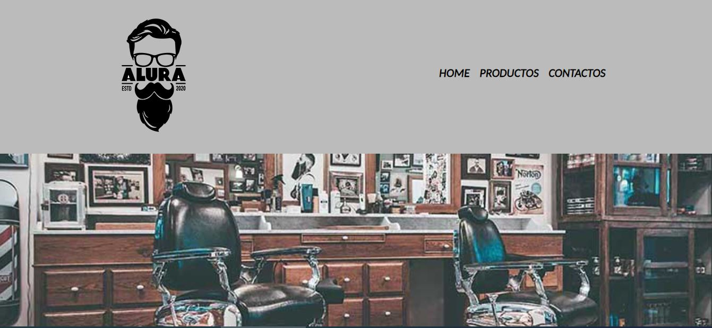
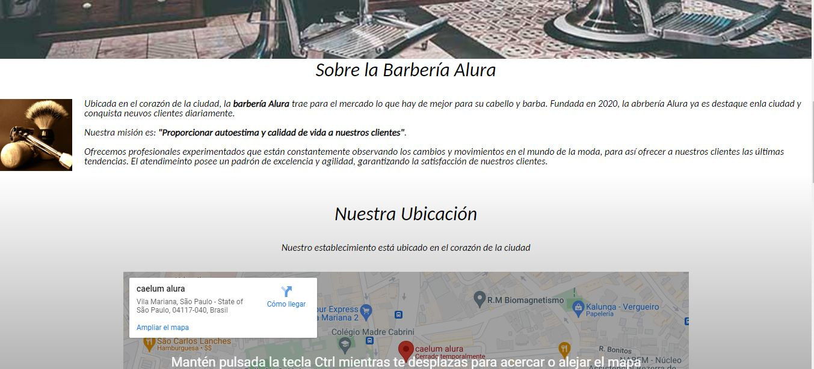
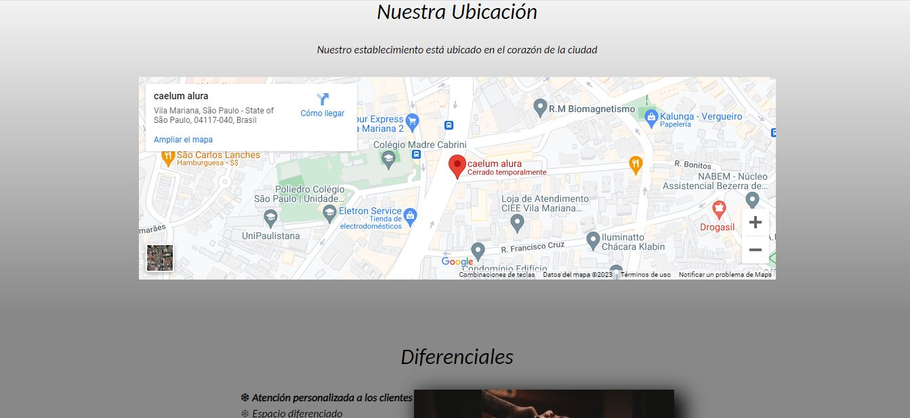
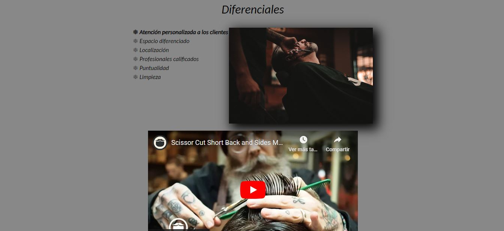
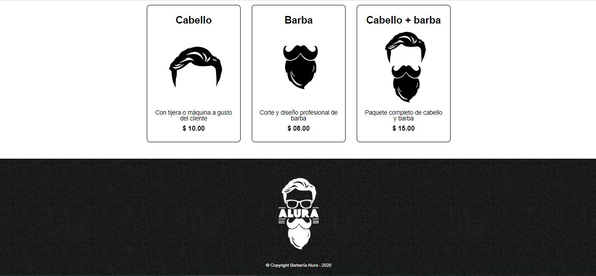

# BarberiaPaginaWeb
Página web de una barbería hecha completamente en HTML5 y CSS3 

# Building a barber shop webpage using HTML and CSS, a practice from the OracleOne program.

## Table of contents

- [Overview](#overview)
  - [The challenge](#the-challenge)
  - [Screenshot](#screenshot)
- [My process](#my-process)
  - [Built with](#built-with)
  - [What I learned](#what-i-learned)
- [Author](#author)

## Overview

### The challenge

A barber shop must be created for one of Alura Latam's clients using only CSS and HTML.

- On the main page, there will be information about the barber shop.
- There will be a tab to view the price list and haircuts offered by the barber shop.
- Finally, there will be a page with a form for the barber shop to get in touch with you and specify a specific schedule.

### Screenshot

## My process

### Built with

- CSS3
- HTML5

### What I learned

I learned the basic concepts of HTML5 and CSS3, understanding the use of many CSS properties and the way projects are divided into sections with HTML5.

## Author

- LinkedIn - [Juan Pablo Cuartas](https://www.your-site.com)
- Email - [juanpa88842@gmail.com](https://www.linkedin.com/in/juanpablocuartas/)

